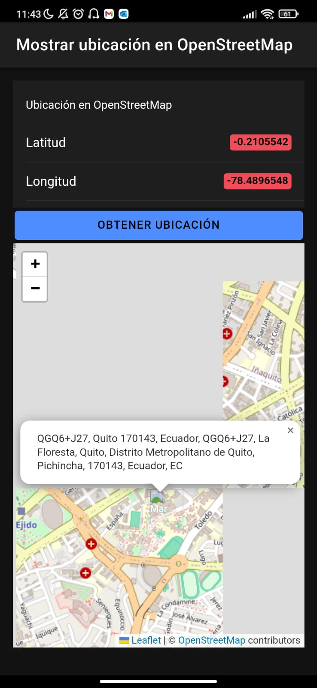

# Proyectos de Ionic

Este repositorio contiene varios proyectos desarrollados con Ionic. Cada proyecto se enfoca en diferentes funcionalidades y utiliza distintos servicios de Firebase para su implementación. A continuación se detallan los proyectos incluidos:

1. [App CV + Firebase Hosting + Infinite Scrolling](URL_Aplicacion_CV)
2. [App Camera](https://github.com/JaredVS777/App_fotos.git) - [Deploy] (fotos1-1f12b.web.app/tabs/tab1)
3. [Login - Firebase Authentication](URL_Login_Firebase)
4. [App for Uploading Files with Storage](https://github.com/JaredVS777/App_storage.git) - [Deploy](storage-f5a23.web.app)
5. [Real-time Chat Application](https://github.com/JosephYM07/Chat_Ionic.git) - [Deploy](https://database-chat-9d1b3.web.app/chat)
6. [Storing Real-time GPS Data in Cloud Firestore](URL_Realtime_GPS)
7. [Display Location on Google Maps or OpenStreetMap](https://github.com/JosephYM07/Display-Location-on-Google-Maps-or-OpenStreetMap.git) - [Deploy](https://ubicaciongps-ee91c.web.app)

## Integrantes del Equipo

- [Joseph Yépez](https://github.com/JosephYM07)
- [Jared Valenzuela](https://github.com/JaredVS777)
- [Alejandro Moreira](https://github.com/Alejandro-Moreira)

## Instrucciones de Instalación

Para cada proyecto, sigue las instrucciones específicas detalladas en su respectivo README.md dentro de su carpeta correspondiente en este repositorio.

## Capturas de Pantalla

A continuación se muestran algunas capturas de pantalla de cada proyecto en ejecución:

### App CV + Firebase Hosting + Infinite Scrolling

### App Camera

### Login - Firebase Authentication

### App for Uploading Files with Storage

### Real-time Chat Application

  
  
  

### Storing Real-time GPS Data in Cloud Firestore

### Display Location on Google Maps or OpenStreetMap

  
  
  

